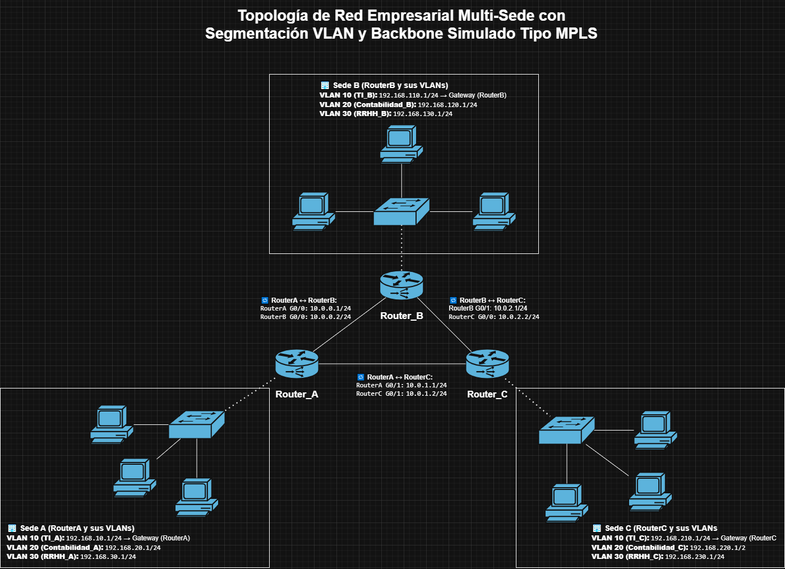

# 🏢 MPLS Enterprise Network Lab – Proyecto de Simulación Profesional en GNS3

Este repositorio contiene un laboratorio técnico de simulación de una red empresarial de tres sedes interconectadas mediante un backbone MPLS y enrutamiento dinámico OSPF. El proyecto fue desarrollado siguiendo principios de diseño profesional y buenas prácticas de documentación técnica.

---

## 🎯 Objetivo del Proyecto

- Simular una red empresarial multi-sede (Sede A, B y C)
- Implementar segmentación por VLAN en cada sede
- Configurar enrutamiento dinámico con OSPF
- Implementar backbone MPLS funcional con LDP
- Documentar configuraciones, fallas, validaciones y plan de contingencia
- Ejecutar pruebas de conectividad interdepartamental

---

## 📂 Estructura del Proyecto

```bash
Mpls_Enterprise_Network_Lab/
│
├── README.md                        ← Resumen general del proyecto (este archivo)
├── .gitignore                       ← Exclusiones para control de versiones
│
├── configuraciones/                ← Configuraciones de todos los dispositivos
│   ├── configuracion-completa.txt
│   ├── vpcs-sedeA.txt
│   ├── vpcs-sedeB.txt
│   └── vpcs-sedeC.txt
│
├── documentacion/                  ← Documentación técnica estructurada
│   ├── README.md
│   ├── plan-contingencia.md
│   ├── diagnostico-fallas.md
│   ├── pruebas-validacion.md
│   └── arquitectura-red.md
│
├── topologia/
│   ├── topologia.drawio
│   └── topologia.jpeg
│
└── proyecto-gns3/
    └── red-empresarial.gns3project
```

## 🖼️ Topología de Red Empresarial



> 📝 El archivo fuente editable del diagrama está disponible en [`topologia/topologia-red-empresarial-mpls.drawio.png`](topologia/topologia-red-empresarial-mpls.drawio.png)

---

## 🔗 Autor

👨‍💻 **Bruno San Martín Navarro**  
🔗 [LinkedIn – sanmabruno](https://www.linkedin.com/in/sanmabruno/)
